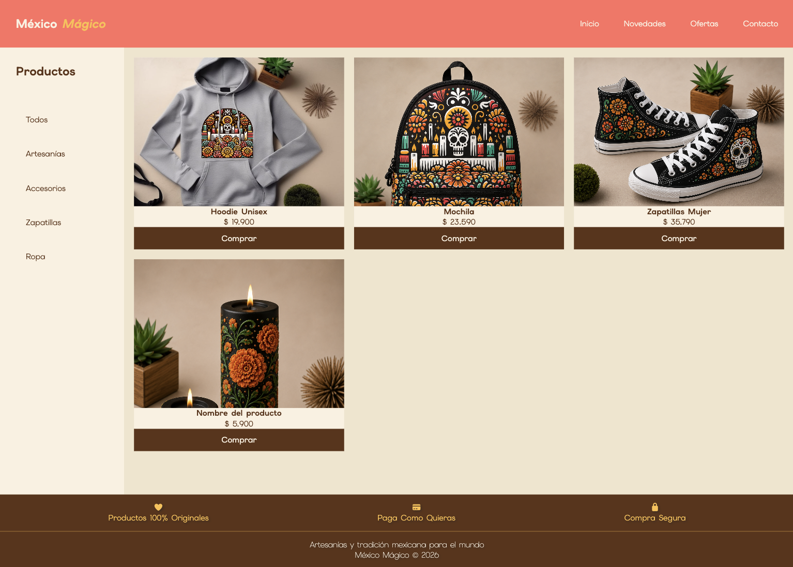

# México Mágico — Tienda Online
Proyecto de desafío semanal: tienda online temática desarrollada con HTML5 y CSS3, aplicando CSS Grid y Flexbox para la construcción del layout y los componentes.
___

## Requerimientos del desafío 🏅
1. Crear un layout con CSS Grid y su propiedad grid-template-areas. (4 Puntos)
2. Crear una grilla de productos con CSS Grid. (4 Puntos)
3. Utilizar Flexbox para la distribución de elementos de la barra lateral.(1 Punto)
4. Utilizar Flexbox para la construcción de las tarjetas de productos. (1 Punto)
___

## Vista previa 👀
https://tmanzur.github.io/dlm_grid_layout_ecommerce/


___

## Tecnologías utilizadas 👩🏻‍💻

HTML5 semántico
CSS3 (Grid + Flexbox)
Google Fonts — Elms Sans
Font Awesome (íconos del footer)
___

## Estructura del layout 📏
El layout principal está construido con CSS Grid usando grid-template-areas:
```
css.grid-container {
    display: grid;
    grid-template-areas:
        "navbar  navbar"
        "sidebar content"
        "foot    foot";
    grid-template-columns: 250px auto;
    grid-template-rows: 6rem 1fr auto;
}
```
```
┌─────────────────────────────┐
│           NAVBAR            │
├──────────┬──────────────────┤
│          │                  │
│ SIDEBAR  │     CONTENIDO    │
│          │   (grilla de     │
│          │   productos)     │
├──────────┴──────────────────┤
│           FOOTER            │
└─────────────────────────────┘
```
___

## Estructura de archivos 📁

```
├── index.html
├── README.md
└── assets/
    ├── css/
    │   └── style.css
    └── img/
        ├── hoodie.jpg
        ├── mochila.png
        ├── zapatillas.png
        └── velas.png
```
___

🎀 Autor
Tatiana Manzur M.
Desafío semanal — Bootcamp Desafío Latam
2026